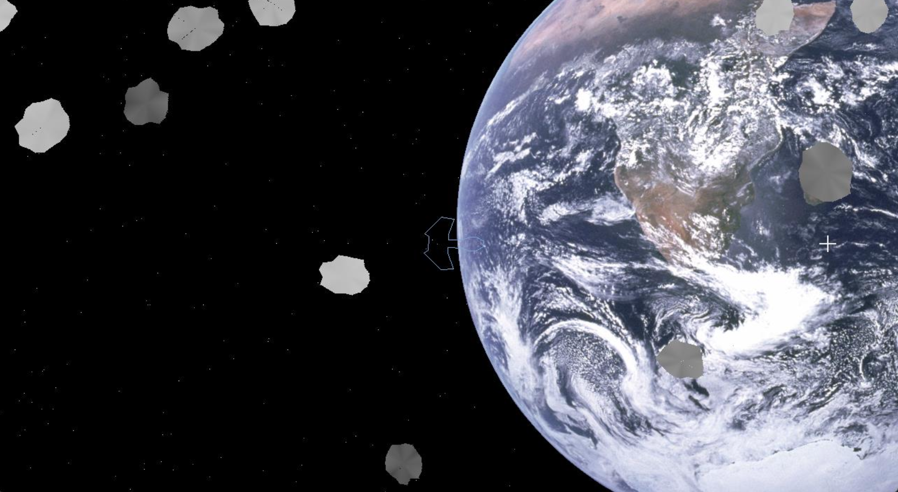

# Space Orbital Visulisation

## Overview
This application allows users to control a customizable spaceship, navigate through a space-themed environment, and experiment with graphics programming techniques.

## Startup
To launch the Space Explorer Graphics Simulator:
1. Download the latest release from our repository.
2. Extract the files to your preferred location.
3. Run the executable file to start the simulation.

## Main Screen

## Using the Application
To get started, use the arrow keys to move the spaceship to the desired position on the screen. Pressing spacebar increases speed and changing the direction of the mouse changes direction of spaceship.

## Conclusion
The Space Graphics Simulator was a hands-on approach to learning and experimenting with fundamental computer graphics techniques. Through interactive controls and a variety of operations, users can explore the principles of graphics programming in a visually engaging and intuitive environment.
